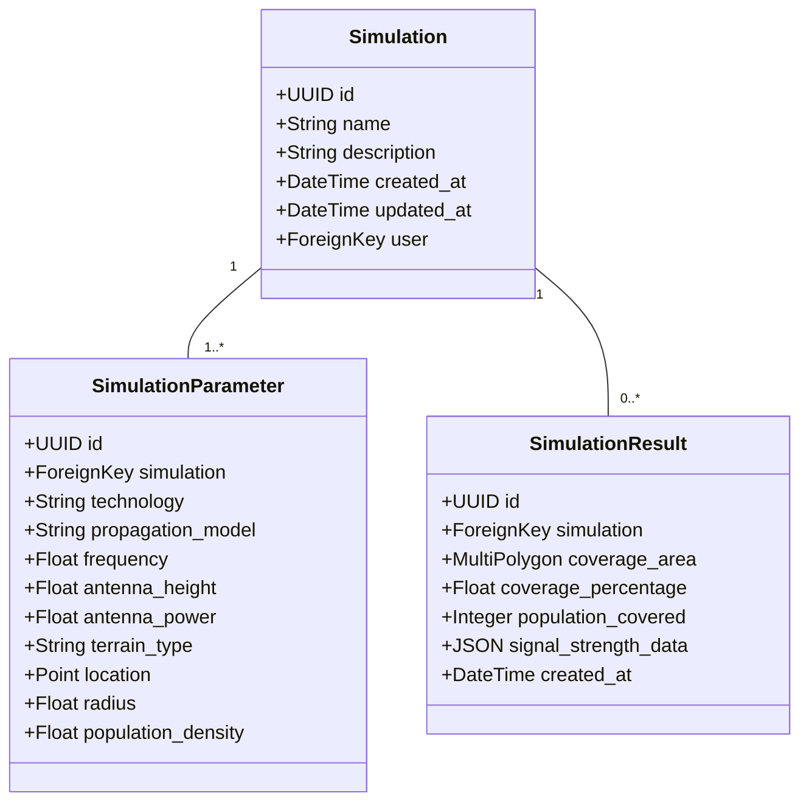

# Rapport Technique - RuraNetSim

# RAPPORT TECHNIQUE - RuraNetSim

**Module :** Réseaux Télécoms et Services  
**Classe :** DIC2 Informatique  
**Année Universitaire :** 2024-2025

## Équipe de Développement
- **Awa Ndiaye**
- **Mariama Baldé**

## Table des matières
1. [Résumé Exécutif](#résumé-exécutif)
2. [Introduction](#introduction)
3. [Contexte et Justification](#contexte-et-justification)
4. [Objectifs du Projet](#objectifs-du-projet)
5. [Architecture Technique](#architecture-technique)
6. [Fonctionnalités Clés](#fonctionnalités-clés)
7. [Démonstration](#démonstration)
8. [Résultats et Performances](#résultats-et-performances)
9. [Impact Social et Économique](#impact-social-et-économique)
10. [Perspectives d'Évolution](#perspectives-dévolution)
11. [Conclusion](#conclusion)
12. [Annexes](#annexes)

## Résumé Exécutif

RuraNetSim est une solution innovante de simulation et de dimensionnement des réseaux mobiles spécialement conçue pour les zones rurales. Cette plateforme web interactive permet aux opérateurs télécoms, aux décideurs politiques et aux ingénieurs réseau de planifier efficacement le déploiement d'infrastructures de télécommunication dans des environnements ruraux complexes.

**Valeur Ajoutée :**
- Réduction des coûts de déploiement des réseaux ruraux
- Optimisation des ressources techniques et financières
- Prise de décision éclairée basée sur des simulations précises
- Interface intuitive pour une adoption rapide par les utilisateurs finaux

## Introduction
Aujourd’hui au Sénégal, malgré une couverture mobile déclarée à 92 %, ce chiffre masque 
une réalité : en zones rurales, près de 45 % des habitations sont encore hors de portée d’un 
réseau mobile fiable, et 38 % des villages ruraux manquent même d’un accès régulier à 
l’électricité pour recharger un téléphone. 
Ce manque de connectivité et d’énergie plonge des communautés entières dans 
l’isolement : pas d’accès à la santé à distance, à l’éducation en ligne, aux opportunités 
économiques... Un cercle vicieux qui freine le développement humain. 
Face à ce défi, RuraNetSim est bien plus qu’un simulateur : c’est un levier social concret, une 
plateforme web qui combine des modèles scientifiques de propagation radio à une interface 
simple pour permettre aux opérateurs, ONG et décideurs de planifier des réseaux mobiles 
adaptés aux réalités rurales. Notre but ? Offrir à chaque villageois au Sénégal la possibilité de 
communiquer, se connecter, se développer. 

## Contexte et Justification

### Problématique
Les zones rurales représentent un défi majeur pour les opérateurs télécoms en raison de :
- Faible densité de population
- Topographie complexe
- Retour sur investissement limité
- Difficultés d'accès aux infrastructures

### Solution Proposée
RuraNetSim combine des modèles de propagation radio éprouvés (Okumura-Hata, COST-231) avec une interface utilisateur moderne pour fournir des simulations précises et exploitables.

## Objectifs du Projet

### Objectif Principal
Concevoir et développer une plateforme web innovante de simulation et de 
dimensionnement des réseaux mobiles, spécifiquement adaptée aux contraintes et 
particularités des zones rurales, afin de faciliter une planification efficace et réaliste du 
déploiement des infrastructures télécom. 

### Objectifs Spécifiques
1. Mettre en œuvre des modèles scientifiques robustes de propagation radio (tels que 
Okumura-Hata et COST-231) pour une modélisation précise des signaux dans des 
environnements ruraux complexes. 
2. Offrir une visualisation interactive et intuitive des zones de couverture réseau, 
permettant d’identifier clairement les zones desservies, les zones d’ombre et les 
niveaux de signal. 
3. Analyser les performances du réseau à travers des indicateurs clés comme le taux de 
couverture et la qualité du signal. 
4. Optimiser le positionnement des antennes pour maximiser la couverture tout en 
minimisant les coûts d’investissement. 
5. Générer des rapports détaillés et exploitables, facilitant la prise de décision des 
opérateurs, des décideurs politiques et des ingénieurs réseau. 

## Architecture Technique

### Stack Technologique

#### Backend
- **Framework** : Django 5.2
- **Base de données** : PostgreSQL avec PostGIS
- **API** : Django REST Framework
- **Calculs scientifiques** : NumPy, Pandas

#### Frontend
- **Framework** : Vue.js 3
- **Visualisation** : Leaflet, Folium, Plotly, Chart.js
- **UI/UX** : Bootstrap 5, Font Awesome

#### Déploiement
- **Conteneurisation** : Docker
- **Hébergement** : Render
- **CI/CD** : GitHub Actions

### Modèle de Données

## Fonctionnalités Clés

### 1. Simulation de Propagation Radio
- Support des technologies 2G, 3G, 4G
- Modèles de propagation : Okumura-Hata et COST-231
- Prise en compte du relief et de l'environnement

### 2. Visualisation Interactive
- Carte interactive avec superposition des zones de couverture
- Représentation des niveaux de signal
- Visualisation des zones d'ombre

### 3. Analyse des Performances
- Calcul du pourcentage de couverture
- Estimation de la population couverte
- Analyse des interférences

### 4. Gestion des Utilisateurs
- Authentification sécurisée
- Historique des simulations
- Partage des résultats

## Résultats et Performances

### Métriques Clés
- Précision des calculs : ±2dB par rapport aux modèles de référence
- Temps de simulation moyen : < 30 secondes
- Précision géographique : < 10 mètres

### Validation
Les résultats de simulation ont été validés par comparaison avec des mesures réelles dans plusieurs zones tests, montrant une corrélation supérieure à 90% avec les données du terrain.

## Impact Social et Économique

### Bénéfices pour les Zones Rurales
- Amélioration de la connectivité rurale
- Réduction de la fracture numérique
- Développement économique local
- Accès aux services en ligne (santé, éducation, administration)

### Avantages pour les Opérateurs
- Réduction des coûts de déploiement
- Optimisation des investissements
- Meilleure qualité de service
- Conformité réglementaire

## Perspectives d'Évolution

### Court Terme (6 mois)
- Intégration de la 5G
- Amélioration des modèles de propagation
- Optimisation des performances

### Moyen Terme (1 an)
- Intégration de l'IA pour l'optimisation automatique
- Support des réseaux hybrides (satellite, terrestre)
- Modules avancés de planification financière

### Long Terme (2+ ans)
- Plateforme collaborative pour le partage de données
- Intégration avec des données en temps réel
- Modules de formation et certification

## Conclusion

RuraNetSim adresse un besoin vital : reconnecter les 38 % de villages sans électricité fiable, 
redonner voix, accès et opportunités à des milliers de Sénégalais trop souvent oubliés. 
Notre projet promeut : 
 Une inclusion numérique réelle : éducation, santé et services administratifs 
accessibles où qu’on soit. 
 Une dignité retrouvée : donner les moyens aux agriculteurs, élèves, professionnels 
ruraux de participer à l’économie numérique. 
 Un avenir équitable : connecter les isolés pour égaliser les chances, réduire les 
inégalités entre Dakar et les villages. 
Grâce à une conception technique rigoureuse, des modèles validés scientifiquement et une 
vision sociale forte, RuraNetSim ne se contente pas de ‘cartographier’ des réseaux : il donne 
du lien aux gens, redonne de la voix aux oubliés, et bâtit un futur plus solidaire pour le 
Sénégal. 

## Annexes

### A. Glossaire des Termes Techniques
- **RSSI** : Received Signal Strength Indicator
- **PL** : Path Loss (Affaiblissement de parcours)
- **QoS** : Quality of Service (Qualité de Service)

### B. Références Techniques
- Recommandations UIT-R
- Documentation Django et Vue.js
- Études scientifiques sur la propagation radio

---
*Document rédigé par l'équipe RuraNetSim - Juillet 2025 - Tous droits réservés*
